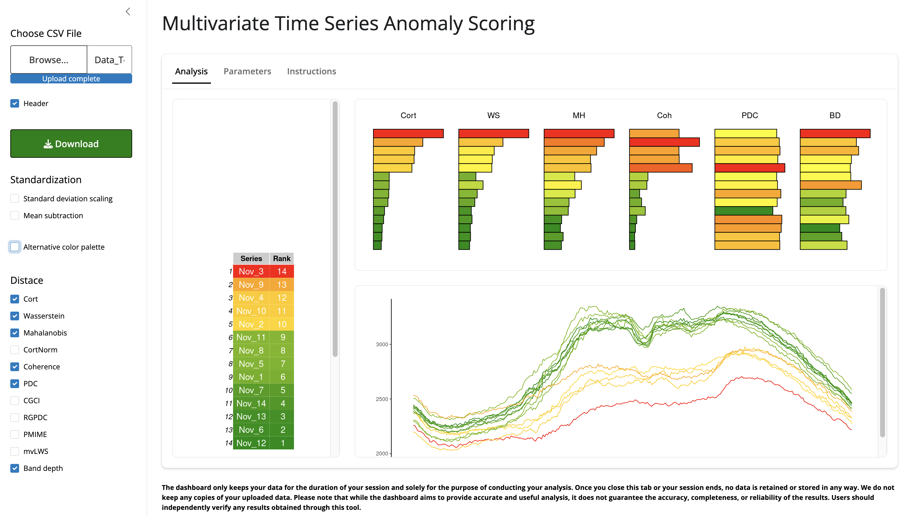

# Multivariate Time Series Anomaly Scoring Dashboard
 This dashboard benchmarks time series in a multivariate set by assigning an anomaly score using a nearest-neighbor approach. In brief, an anomalous observation will have large distances compared with the rest of the observations, particularly with its nearest neighbors. The anomaly score is the sum of the distances of an observation with its nearest neighbors. We extended this concept to time series by exploring different distances between time series.

The dashboard can be accessed via the following link: 

https://cuauhtemoctzin.shinyapps.io/anomaly_tool/

The dashboard only keeps your data for the duration of your session and solely for the purpose of conducting your analysis. Once you close this tab or your session ends, no data is retained or stored in any way. We do not keep any copies of your uploaded data. Please note that while the dashboard aims to provide accurate and useful analysis, it does not guarantee the accuracy, completeness, or reliability of the results. Users should independently verify any results obtained through this tool.

This tool was supported by the UK Research and Innovation (UKRI) Engineering and Physical Sciences Research Council (EPSRC) under the project titled "Reducing End Use Energy Demand in Commercial Settings Through Digital Innovation," grant number EP/T025964/1.
